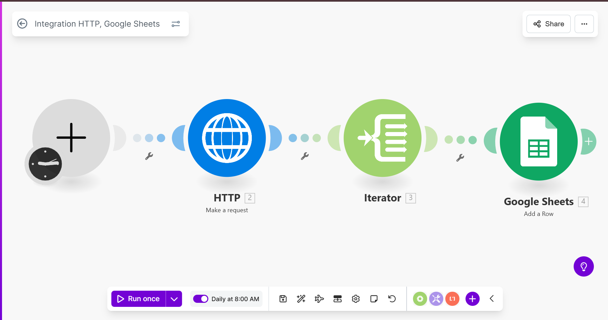

### This Make.com scenario automates the process of fetching data from News API at scheduled intervals, processing the data, and logging the results into a Google Sheets spreadsheet. It is a robust, hands-off system for data collection and centralization.

## Core Workflow:

Here's a screenshot of the complete Make.com scenario:

*Figure 1: Complete workflow showing all modules and connections*

## 1. Schedule
This is the trigger that initiates the entire scenario.

**Type: Schedule**

Function: Starts the scenario automatically at 8 am every day.

## 2. HTTP Request
This module performs a call to an external API to retrieve data.

**Type: HTTP > Make a Request**

Function: Fetches data from the News API endpoint.

## 3. Iterator
This module breaks down the array from the API response so it can be processed one by one.

**Type: Iterator**

Function: Takes the array of data objects from the HTTP response and cycles through each one individually.

## 4. Google Sheets
This is the action module that writes the processed data into a spreadsheet.

**Type: Google Sheets > Update Row**

Function: Takes the data from the current iteration and adds or updates a row in the specified spreadsheet.

